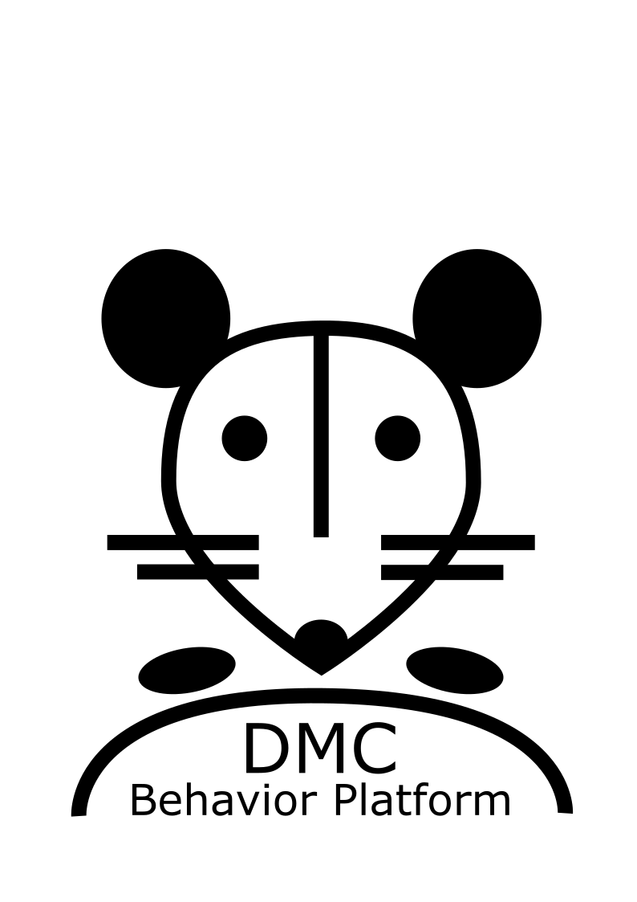

<div align="center">
  
</div>


# *DMC-Behavior Platform* for auditory behavioral tasks in head-fixed mice
## Assembly of behavioral setups, software installation and operation
### Hardware assembly
*see installation guide: `.docs/DMC-Behavior-Platform_Hardware-assembly.md`*  
*see parts list: `.docs/DMC-Behavior-Platform_parts-list.xlsx`*

### Software installation
*see installation guide: `.docs/DMC-Behavior-Platform_Software-installation.md`*

### Operation of setups
*see guide: `.docs/DMC-Behavior-Platform_Day-to-day-operation.md`*

## Citation
If you use the DMC-Behavior Platform (`RRID:SCR_027434`) in your scientific work, please cite:
```
Jung, F., Cao, X., Heymans, L., Carlén, M. (2025) "DMC-Behavior Platform: An Open-Source Framework for Auditory-Guided Perceptual Decision-Making in Head-Fixed Mice", eNeuro, https://doi.org/10.1523/ENEURO.0457-24.2025
```

BibTeX:

``` bibtex
@article{Jung2025e,
author = {Jung, Felix and Cao, Xiao and Heymans, Loran and Carl{\'{e}}n, Marie},
doi = {10.1523/ENEURO.0457-24.2025},
issn = {23732822},
journal = {eNeuro},
keywords = {Raspberry Pi,auditory,head-fixed behaviors,perceptual decision-making,standardization},
month = {apr},
number = {4},
pmid = {40210486},
publisher = {Society for Neuroscience},
title = {{The DMC-Behavior Platform: An Open-Source Framework for Auditory-Guided Perceptual Decision-Making in Head-Fixed Mice}},
volume = {12},
year = {2025}
}

```