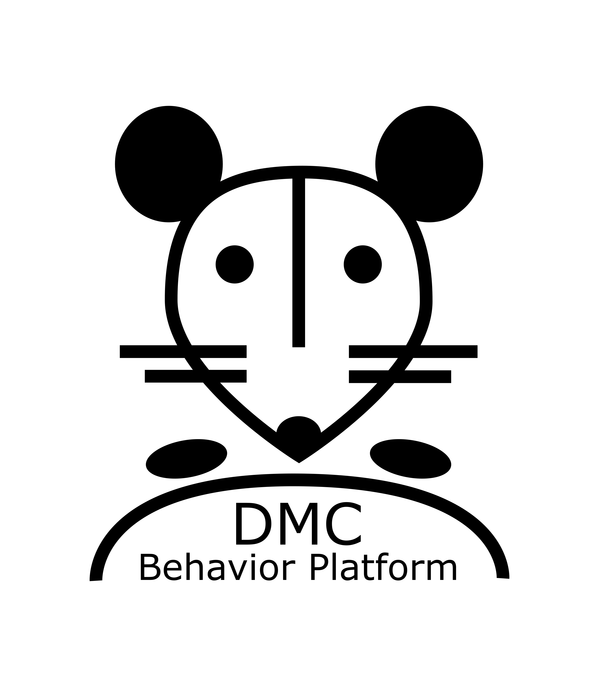

  

# *DMC-Behavior Platform* for auditory behavioral tasks in head-fixed mice
## Assembly of behavioral setups, software installation and operation
### Hardware assembly
*see installation guide: `.docs/DMC-Behavior-Platform_Hardware-assembly.md`*  
*see parts list: `.docs/DMC-Behavior-Platform_parts-list.xlsx`*

### Software installation
*see installation guide: `.docs/DMC-Behavior-Platform_Software-installation.md`*

### Operation of setups
*see guide: `.docs/DMC-Behavior-Platform_Day-to-day-operation.md`*

## Citation
