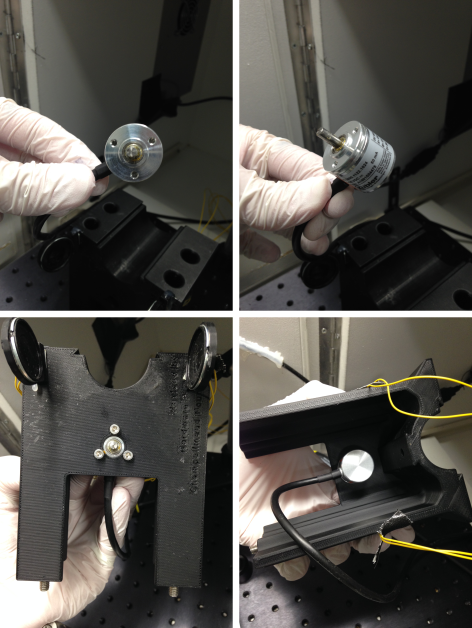
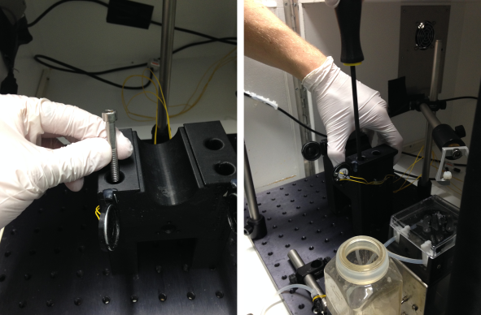
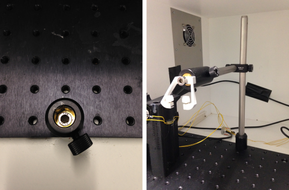
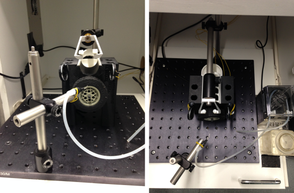
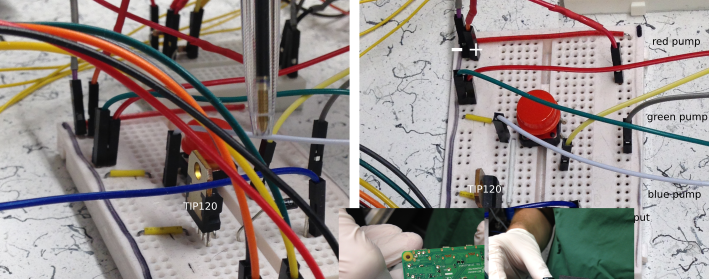
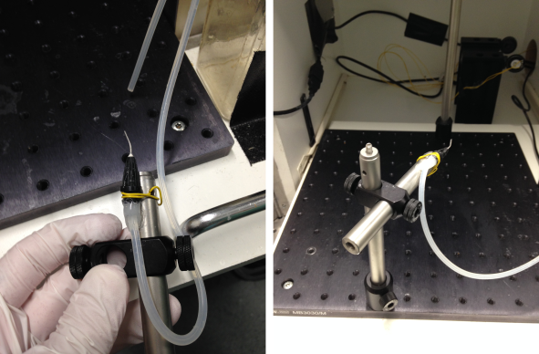
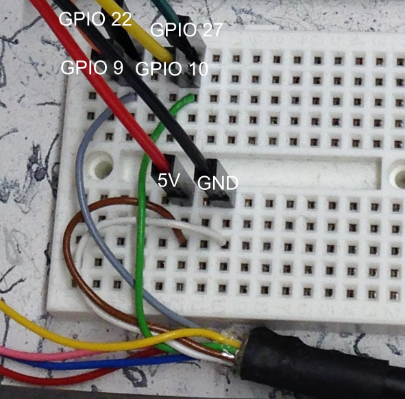
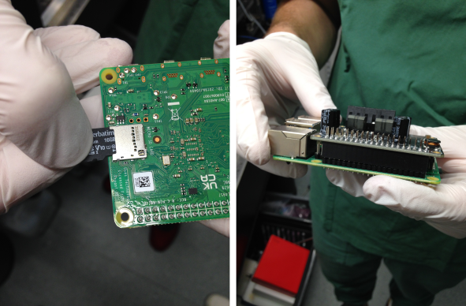

# *DMC Behavior Platform* - hardware assembly guide

for a detailed parts list, see the *DMC-Behavior_parts-list.xlsx* file
## Important info before starting

You will be working with electricity and perform soldering, be mindful of what you are doing, search and ask for help if you are unsure what and how do to! If you have never worked with similar electrical components, it is *strongly* recommended to educate yourself and/or ask for help before starting to assemble the setup!

## Head-fixation setup
- attach the rotary encoder (05.2400.1122.1024) to the 3D printed mouse holder using 3x SH3M5 M3 screws, so that the coupler is facing outward and the rotary encoder body is housed inside the mouse holder  
  

- place the 3D printed mouse holder at the center of the MB3030/M breadboard and secure it using 4x M6 (45 mm) screws  
 

- assemble the head-bar holder posts by connecting 1x MS1R/M post with 1x MS1.5R/M post using 1x RA90/M clamp (the MS1.5R/M post will be connected to the head-bar holder and the MS1R/M will be connected to the MB3030/M breadboard)
- place 1x PH30/M post holder behind the 3D printed mouse holder fix it with 1x M6 (20 mm) screw
- attach the assembled head-bar holder posts and fix the PH30/M thumbscrew and attach your connector to head-fix the animals  
 

- connect the 3D printed wheel/encoder coupler to the steering wheel (86652/32019) and attach it to the coupler of the rotary encoder (the wheel should spin freely and without resistance)
- connect the 3D printed poop tray and 3D printed mouse cover to the mouse holder  
 

## Liquid reward delivery system
- for liquid reward delivery, a precision liquid feed pump (CI.80204E-0.5) is used. the pump is powered by a 24VDC/1.5A power supply that allows to turn on the pump continuously (used for flushing) using the priming switch or to operate it using pulses (during experiments)  
- **do not plug in the power supply until the end of this guide!**
- cut the end of the power supply used to power the pump (RND 320-00089) and solder connecting jumper wires to the respective + (voltage/plus/power) and - (minus/ground/0V) ends 
- the pump has 3 cables to connect to: red=24/28V, green=ground/0V and blue=operate (connect to GND/OV for operation)
- *optional*: solder connecting jumper wires to the cables of pump
- the connections of the power supply-pump-Raspberry Pi are performed via a solderless breadboard (400 tie-points):
  - connect the + and - ends of the power supply to the + and - lanes of the breadboard
  - connect the red cable from the pump to the + lane and the green cable from the pump to the - lane
  - the pump is controlled by the Raspberry Pi via a transistor (TIP120) that allows to connect the blue (operating) cable of the pump to the - lane:
    - place the TIP120 transistor on the breadboard so that its pins are not connected to each other
    - connect a jumper wire (that will be later connected to the Raspberry Pi) to the left pin of the TIP120 transistor
    - connect the blue cable of the pump to the center pin of the TIP120 transistor
    - connect the right pin of the TIP120 transistor to the - lane
  - *optional*: place a push button (PCB) on the breadboard and connect one pin to the - lane and another to the blue cable (this allows to deliver liquid reward upon pushing the button)  
 

- attach the tubings to the pump (CI.80204E-0.5) and attach a licking spout (Cannula Luerlock 0.9 mm) using a hot glue gun
- assemble the spout holder using two MS05R/M posts, a PH50/M post-holder, an angled post holder (RA90/M) and a M6 cap screw (20 mm) as done for the head-bar holder (see above)
- connect the licking spout to the spout holder using some spare wires or a hot glue gun  
  

## Speaker system
- solder speaker wires (C1362.21.01) of the desired length to two speakers (K 28 WP - 8 Ohm - Miniature Speaker 28mm 1W 8Ohm 75dB)
- attach the speakers to the 3D printed speaker cases and attach the assembled speakers to the 3D printed mouse holder using a hot glue gun (the speakers should be positioned symmetrically around the head of the animals)

## Raspberry Pi/Hifiberry Amp2
- flash the SD card, insert it to the Raspberry Pi and attach the Hifiberry Amp2 (see **DMC-Behavior-Platform_Software-installation.md** ) 
- using the breadboard, connect the pins to the dedicated hardware components. In the following, we will use an arbitrary chosen set of pins as specified in the default *droid_prefs.json* file
- the rotary encoder:
  - connect the brown wire from the encoder to a 5V pin of the Raspberry Pi/Hifiberry
  - connect the white wire from the encoder to a GND pin of the Raspberry Pi/Hifiberry
  - connect the green wire from the encoder to a GPIO pins 27 and 10 of the Raspberry Pi/Hifiberry
  - connect the green wire from the encoder to a GPIO pins 22 and 9 of the Raspberry Pi/Hifiberry
  - cover the open ends of the remaining 4 cables  

- the pump:
  - connect the jumper wire connected to the left pin of the TIP120 transistor to the GPIO pin 16 of the Raspberry Pi/HifiBerry
- the speakers:
  - connect the speaker wires to the speaker ports of the HifiBerry Amp2
- connect the ethernet cable to the Raspberry Pi  

## Start-up
- after everything is connected, connect the power supply to the HifiBerry Amp2 and plug it in
- also plug in the power supply for the pump
